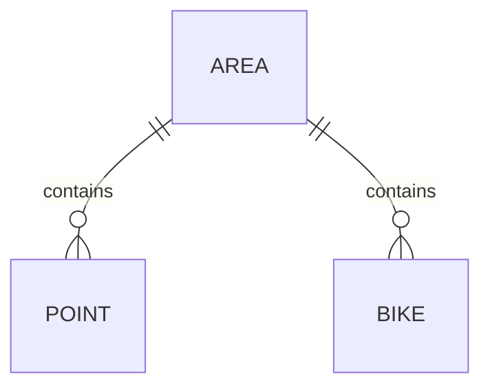

# 大作业 —— 共享单车管理


目录结构：

- `docs`: 相关文档
    - `需求文档.md`：需求文档
    - `需求文档？.md`：需求文档答辩中的答辩版
- `project-android`：移动端
  
   > Kotlin + Jetpack Compose
   
- `project-frontend`：网页前端
  
- `project-service`：服务端
  
    > Docker Compose + Traefik + Golang
    
    由多个用 Golang 编写的微服务组成。
    
    使用 Docker Compose 部署，通过 Traefik 进行服务发现、路由与反向代理。

---




## 骑行区（围栏）

```go
type Point struct {
	ID        uint    `json:"id" gorm:"primaryKey; autoIncrement"`
	Latitude  float64 `json:"latitude"`
	Longitude float64 `json:"longitude"`
	AreaId    int     `json:"-"`
}

type Area struct {
	ID     uint    `json:"id" gorm:"primaryKey; autoIncrement"`
	Name   string  `json:"name" gorm:"uniqueIndex; not null"`
	Latitude  float64 `json:"latitude"`
	Longitude float64 `json:"longitude"`
	Points []Point `json:"points"`
}
```

骑行区，以若干经纬点坐标逆时针围成的一个封闭区域。


以多边形的中点作为骑行区的坐标（简单的平均）


一个单车仅能属于一个骑行区，一个骑行区内多辆单车。

对于骑出围栏的单车，我们显然并不能强制其关锁（安全问题），换言之，即便设置了围栏，我们也没有任何办法阻止单车骑出围栏。

因此，在围栏之外时我们只能发出警告、禁止关锁持续计费。

> 可以额外引入一个，超出围栏一定时间对用户进行处罚（加收费用/禁止骑行）的机制。


然而这并不能保证骑出骑行区的单车一定会被骑回来，那么会有两种情况：

- 单车可能最终停在不属于任何骑行区的区域（不关锁）
- 单车可能最终停在另一骑行区（不关锁）


## 单车

单车由以下两部分组成：

- 物理单车：现实中的物理单车，其上载有硬件设备，以及一个表示其 UID 的二维码
- 逻辑单车：管理端添加的一条单车记录，使用物理单车 UID 进行注册后才会有效


逻辑单车有如下几种状态：

- <font color="purple">未注册</font>：尚未有物理单车与其关联
- 已注册：已经有物理单车与其关联
    - <font color="green">正常</font>
    - <font color="red">位于围栏外</font>
    - <font color="gray">掉线</font>


