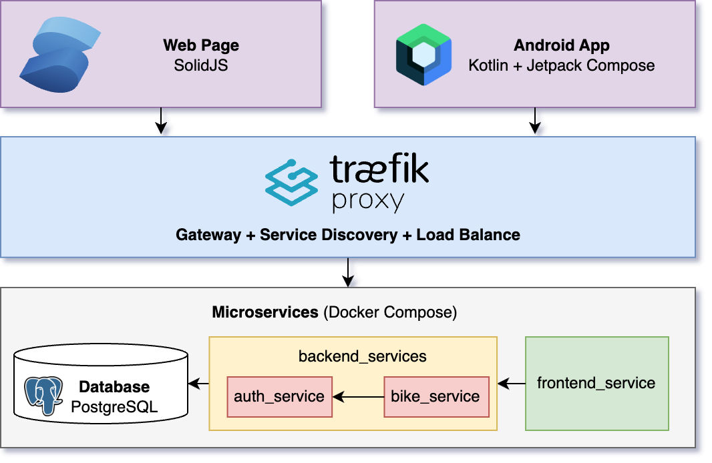
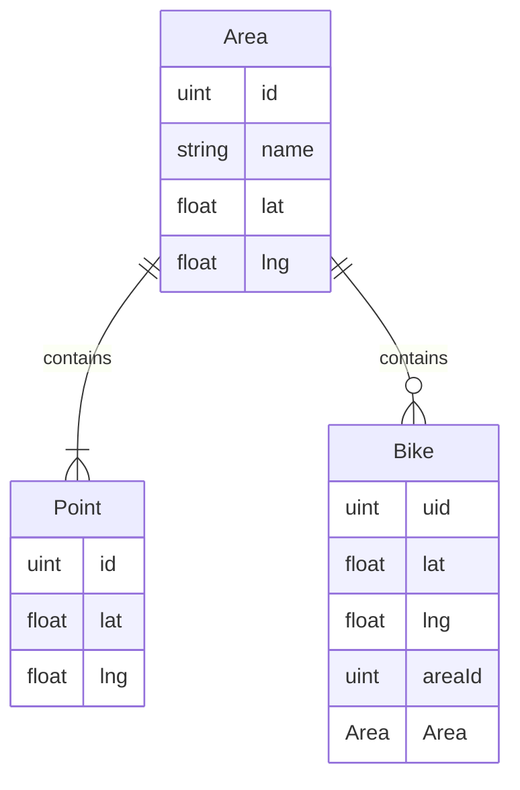
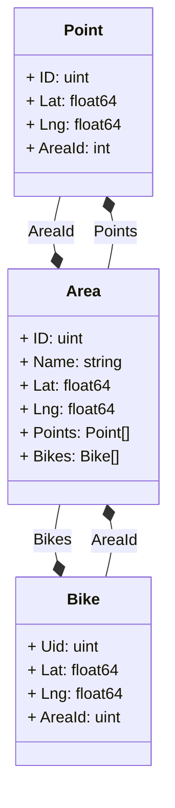
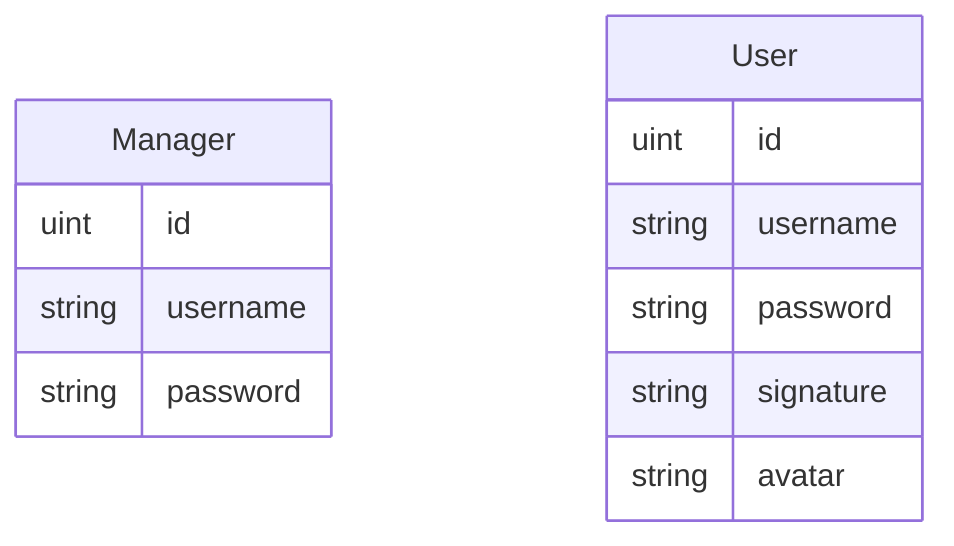
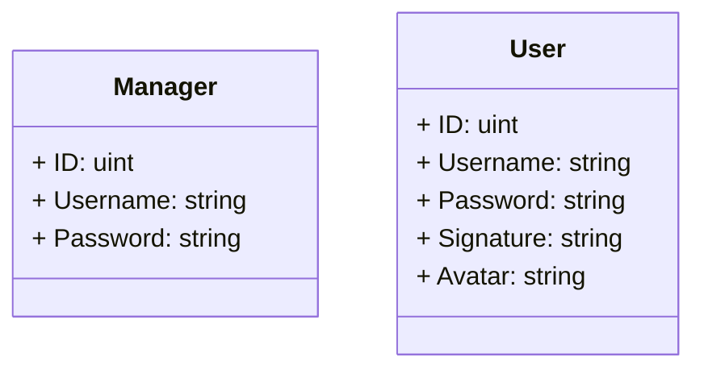

# 设计文档

> 21301021 肖斌

## 一、架构设计

本项目的架构图如上所示，主要分为三层：**应用层**、**中间层**、**服务层**：

- **应用层**：本层承载用户直接接触的应用。

    包含两个应用：

    - 网页应用：基于 SolidJS 框架搭建的网页管理应用。

    - 安卓应用：基于 Kotlin + Jetpack Compose 搭建的安卓应用。

- **中间层**：本层作为应用层与服务层之间的连接，承载网关、服务发现、负载均衡等功能，采用 Traefik Proxy 实现。

- **服务层**：本层承载所有本系统所依赖的服务，所有服务全部容器化通过 Docker Compose 进行部署。

    - 数据库：使用 PostgreSQL 关系型数据库。
    - 后端服务：
        - `auth_servuce`：鉴权服务，负责管理一切用户相关信息，并为其他服务提供鉴权接口。
        - `bike_service`：单车数据服务，负责管理一切单车相关数据。
    - 前端服务：
        - `frontend_service`：前端服务，负责响应页面请求提供前端文件。

## 二、数据库及类设计

由于使用了 Golang + gorm 这一 ORM 库来实现数据库服务，因此主要的“类”的结构定义也即数据库中表结构的定义，因此将类设计与数据库设计放在一节中。

### 2.1 auth 服务数据库及类设计

单车数据库 ER 图如下所示：

涉及的类的类图如下所示：

### 2.2 bike 服务数据库及类设计

用户数据库 ER 图如下所示：

涉及的类的类图如下所示：

## 三、接口设计

接口设计遵循 RESTful 设计

### 1. auth 服务接口

- POST   /api/v1/auth 鉴权接口
- POST   /api/v1/user/login 普通用户登录接口
- POST   /api/v1/user 普通用户注册接口
- PUT    /api/v1/user/password 普通用户修改密码接口
- PUT    /api/v1/user/signature 普通用户修改签名接口
- POST   /api/v1/admin/login 管理用户登录接口
- GET    /api/v1/admin/users 获取普通用户列表接口
- PUT    /api/v1/admin/user/:id/password 更新普通用户密码接口
- DELETE /api/v1/admin/user/:id 删除管理用户接口
- GET    /api/v1/admin/managers 获取管理用户列表接口
- POST   /api/v1/admin/manager 添加管理用户接口
- PUT    /api/v1/admin/manager/:id 更新管理用户信息接口
- DELETE /api/v1/admin/manager/:id 删除管理用户接口

### 2. bike 服务接口

- GET    /api/v1/areas 获取所有骑行区信息接口
- POST   /api/v1/area 创建骑行区接口
- GET    /api/v1/area/:id 获取指定骑行区信息接口
- DELETE /api/v1/area/:id 删除指定骑行区接口
- GET    /api/v1/area/:id/bikes 获取所有单车信息接口
- POST   /api/v1/area/:id/bike 添加单车接口
- DELETE /api/v1/bike/:id 删除单车接口

