# 项目研发总结文档

## 一、基础信息

**项目名称**：BikeApp 共享单车管理系统

**小组成员**：肖斌 21301021

## 二、实现内容介绍

### 2.1 概述

最终实现的内容包括：

- 前端
    - 管理员登录
    - 管理员账号管理
    - 单车管理（增删改查）
    - 骑行区管理（增删改查）
    - 地图可视化
- 后端服务
    - auth 服务
        - 普通用户
            - 登录、注册
        - 管理员用户
            - 登录
            - 管理员账号管理
        - 鉴权接口（供其他服务使用）
    - bike 服务
        - 单车信息管理（增删改查）
        - 骑行区信息管理（增删改查）
        - 单车信息更新接口（供车载端上传数据更新使用）
- Android App
    - 普通用户的登录注册
    - 地图可视化（用户位置、单车位置）
    - 蓝牙扫描周围设备

### 2.1 前端

登录页：

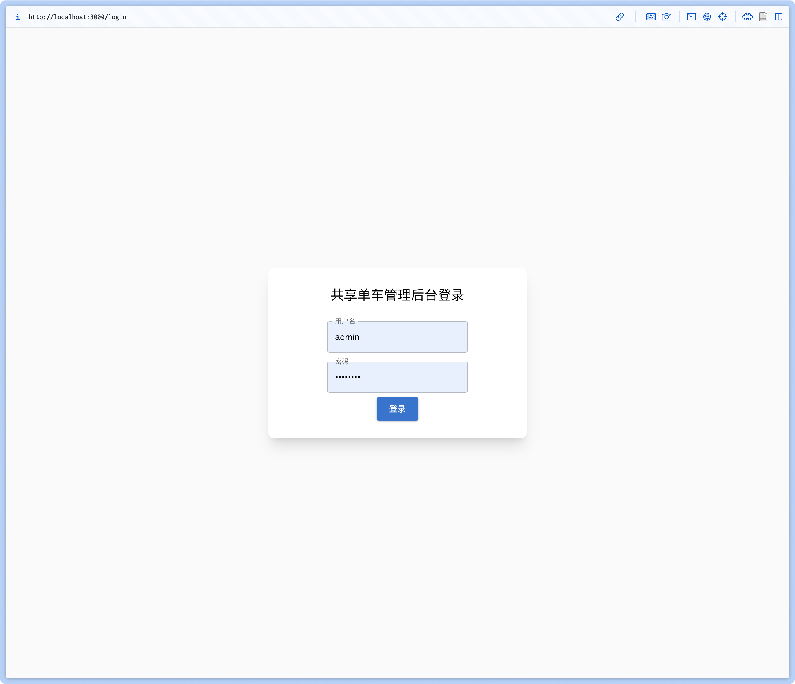

首页（地图可视化）：

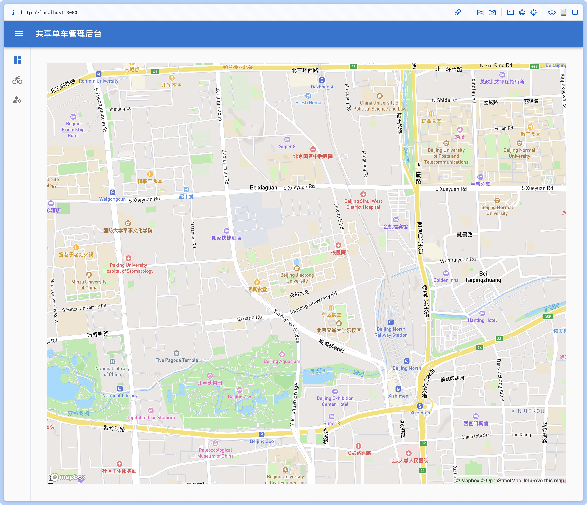

单车管理页（以及相关增删改查）：

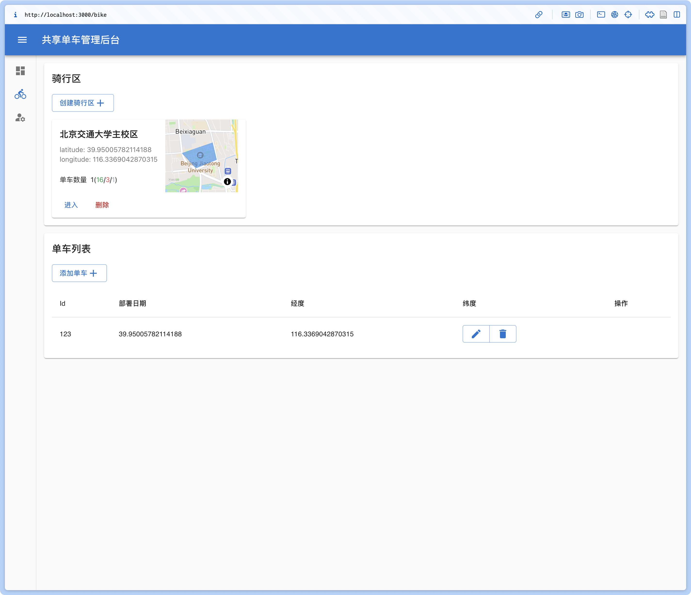

骑行区创建：

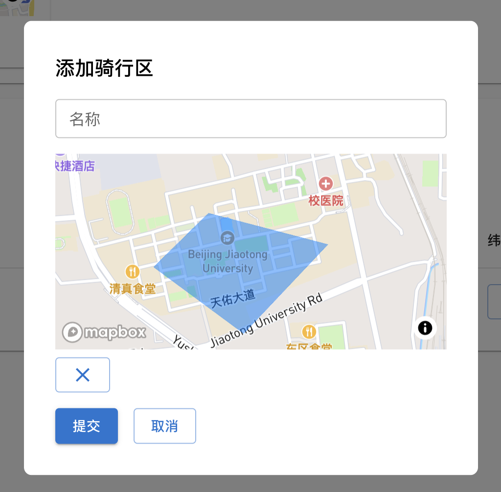

骑行区详情页：

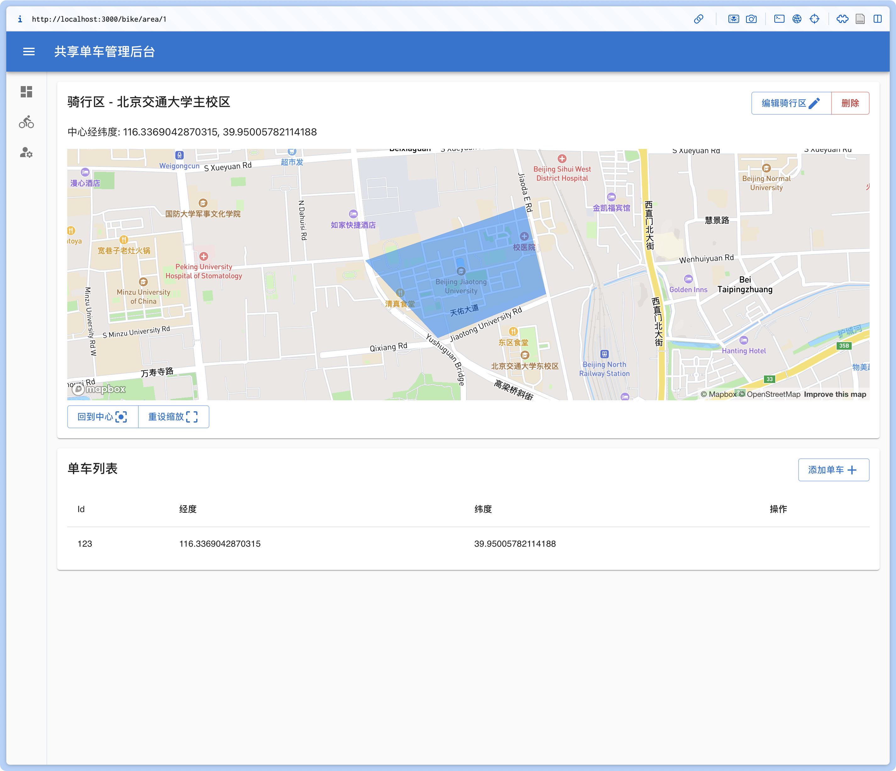

管理员账号管理页（及相关增删改查，下图中的为系统默认的超级管理员账号不可修改/删除）：

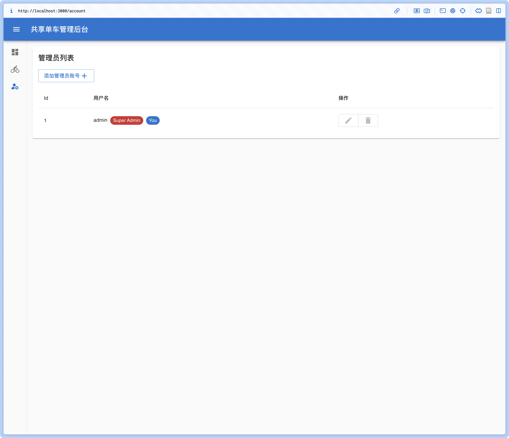

### 2.3 后端

auth 服务：

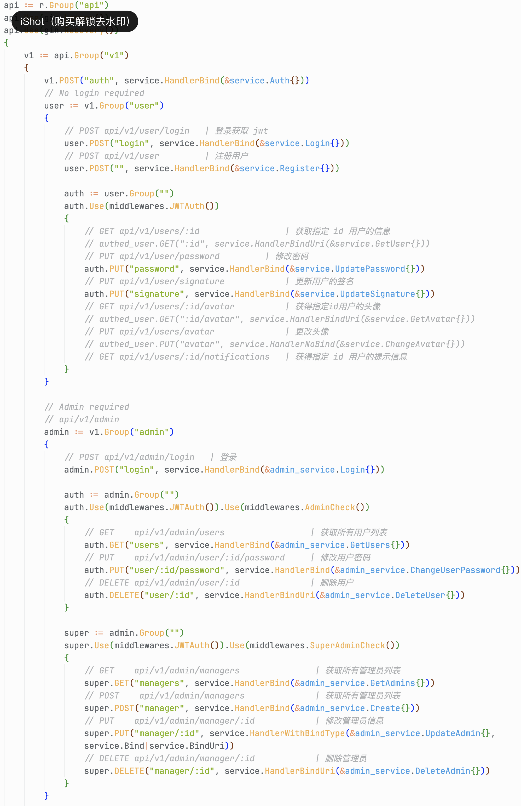

bike 服务：

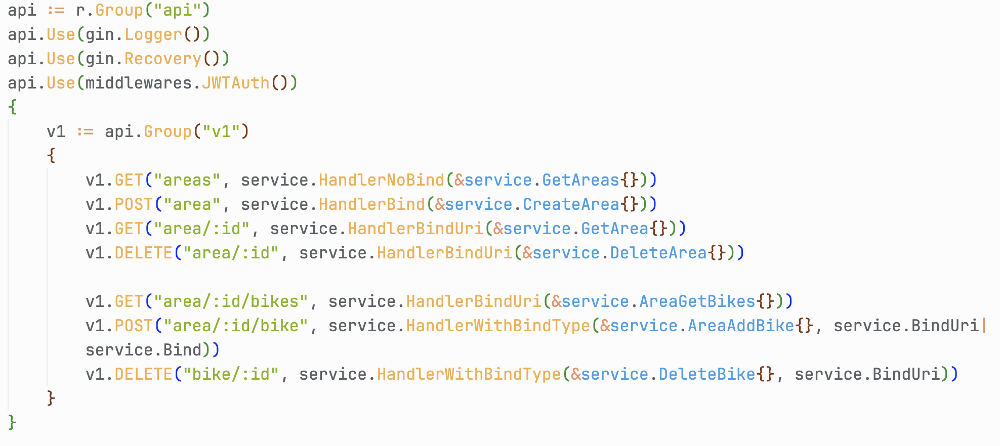

### 2.4 Android App

权限请求页：

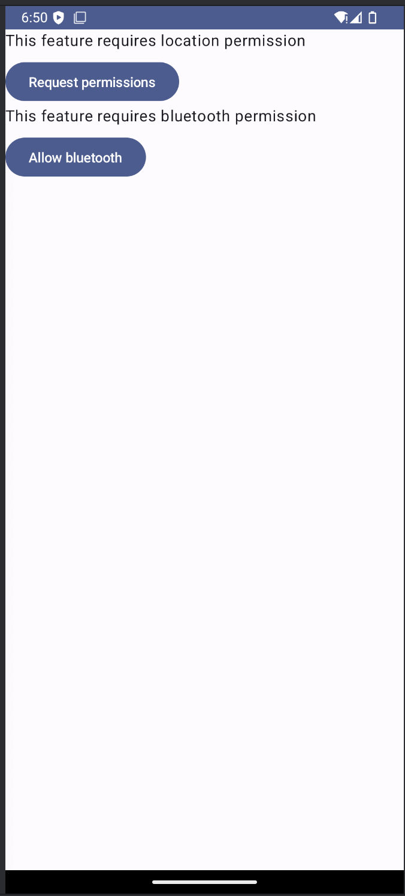 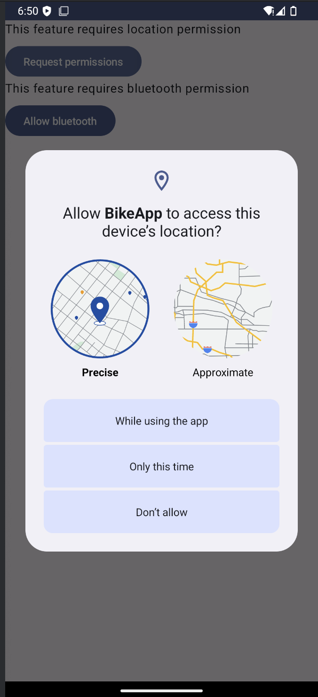

登录与注册页：

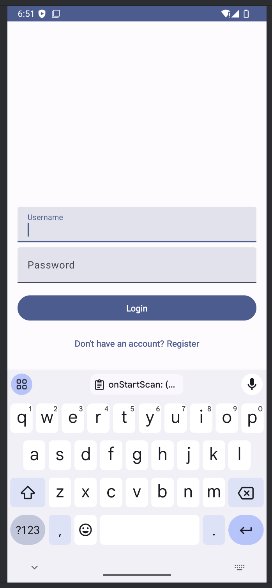 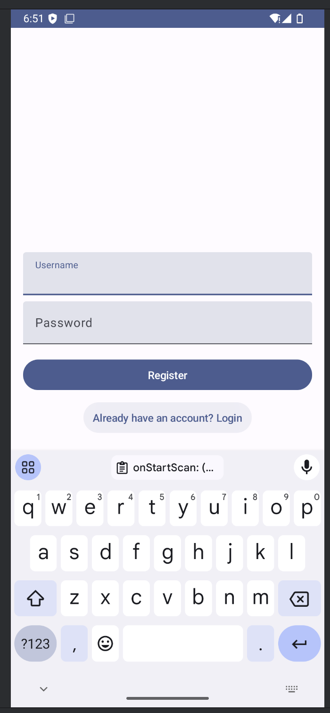

地图可视化（单车、用户位置）页：

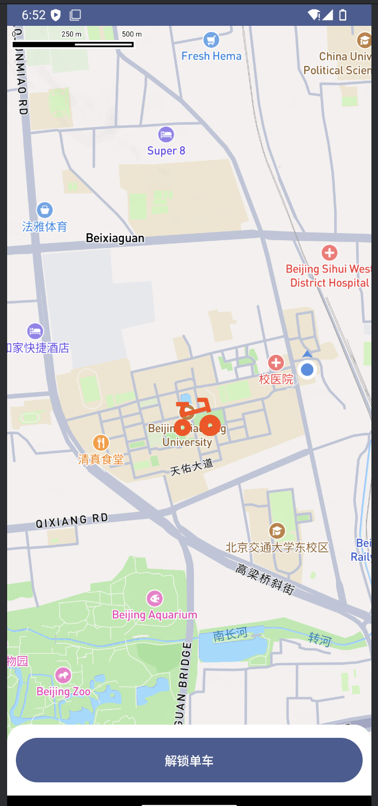

周边蓝牙设备扫描（模拟器无法使用蓝牙）：

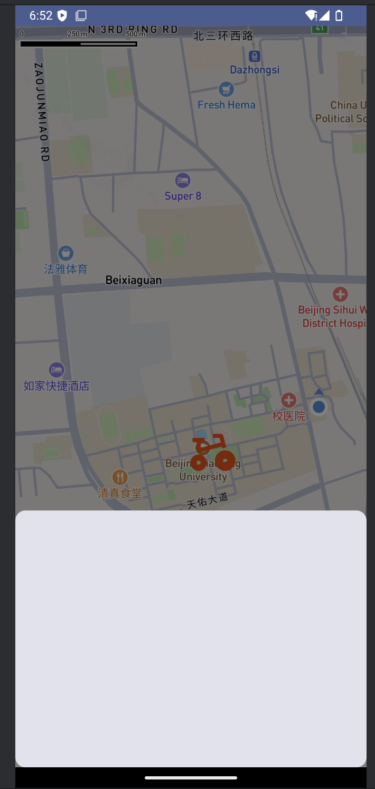

## 三、小组分工与贡献

- 肖斌 21301021 100%
    - 项目架构设计及技术选型
    - 数据库表设计
    - 代码仓库维护、代码质量控制
    - 文档撰写
    - 前端
        - 界面设计
        - 后端 API 对接
        - Mapbox API 对接
        - ......
    - 后端
        - bike 服务开发
        - auth 服务开发
        - 服务部署
        - ......
    - Android App
        - 界面设计
        - Mapbox SDK 对接
        - 网络交互实现
        - ......
    - ......